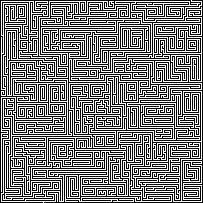

# Maze generator

This bevy app can generate mazes with a recursive backtracking algorithm. The generator moves slowly to allow you to watch the whole process.

After generating a maze, it is saved in a `png` file with white pixels for the path and black pixels for the wall. Press `r` to start generating the next maze.

